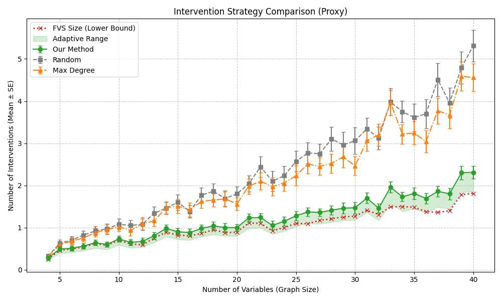

# Adaptive Experiment Design for Cyclic Causal Models

This repository implements an adaptive framework for recovering the causal structure of **Cyclic Linear Structural Causal Models (LSCMs)**. By leveraging Independent Component Analysis (ICA) and a sequence of targeted interventions, this method efficiently reduces the equivalence class of potential causal graphs to a unique solution.

## 📌 Overview

In Linear Structural Causal Models with non-Gaussian noise, the causal structure is often represented by a mixing matrix $W$. While methods like **LiNGAM** work well for acyclic graphs, cyclic graphs present a harder challenge. **ICA** can recover the mixing matrix up to permutation and scaling, leaving a set of possible graphs (an equivalence class).

This project simulates an **Active Learning** loop that:
1.  **Represents** the equivalence class as a Bipartite Graph.
2.  **Refines** the graph actively by identifying unique edges.
3.  **Selects** the optimal variable for intervention using a **Normalized Marginal Benefit** metric.
4.  **Prunes** the graph based on interventional data until the true causal graph is identified.

We benchmark our **Adaptive Strategy** against **Random** and **Max-Degree** intervention strategies.

## 📂 Project Structure

```text
exp-design-cyclic-models/
├── main.py                  # Entry point for running simulations
├── requirements.txt         # Python dependencies
├── results/                 # Output folder for CSVs and Plots
│   └── adaptive_experiment_results_proxy.csv
└── src/
    ├── adaptive_design.py   # Main adaptive loop & intervention logic
    ├── data_generation.py   # Synthetic data generation (Sources & Mixing)
    ├── graph_theory.py      # Graph utilities & Feedback Vertex Set (FVS)
    ├── ica_processing.py    # ICA recovery, thresholding, and alignment
    └── matching_samplers.py # Perfect matching enumeration & sampling
````

## 🚀 Installation

Follow these steps to set up the environment and run the code.

### 1\. Clone the Repository

```bash
git clone [https://github.com/EhsanSharifian/exp-design-cyclic-models.git](https://github.com/EhsanSharifian/exp-design-cyclic-models.git)
cd exp-design-cyclic-models
```

### 2\. Create a Virtual Environment

It is recommended to use a virtual environment to manage dependencies.

**On macOS/Linux:**

```bash
python3 -m venv venv
source venv/bin/activate
```

**On Windows:**

```bash
python -m venv venv
.\venv\Scripts\activate
```

### 3\. Install Dependencies

```bash
pip install -r requirements.txt
```

*Note: This project uses `pulp` for optimization. It usually comes with the default CBC solver included. If you encounter solver errors, ensure you have a linear programming solver installed.*

## 💻 Usage

To run the simulation benchmark comparing the Adaptive, Random, and Max-Degree strategies, simply execute the main script:

```bash
python main.py
```

### Configuration

You can modify simulation parameters directly inside `main.py` to change the scale or nature of the experiments:

  * **`n_sources_range`**: Range of graph sizes (number of variables) to test (e.g., `range(4, 41)`).
  * **`repeats_per_setting`**: Number of trials per graph size (higher = more statistical significance).
  * **`sampler_mode`**:
      * `'exact'`: Uses enumeration (best for small graphs).
      * `'sample'`: Uses greedy sampling (required for larger graphs).
  * **`use_ica_mode`**:
      * `False` (Default): Uses a "Proxy" simulation where ICA recovery is assumed perfect (fast).
      * `True`: Runs full FastICA on generated data (slower, but realistic).

### Outputs

After running the script, the following files will be generated in the `results/` directory:

1.  **`adaptive_experiment_results_proxy.csv`**: Raw simulation data.
2.  **`comparison_plot_Proxy.png`**: Visualization of interventions required vs. graph size.
3.  **`relative_error_plot_Proxy.png`**: Analysis of estimation error.

## 🧠 Methodology

### 1\. The Equivalence Class

ICA recovers the matrix $I - W$ up to permutation $P$ and scaling $\Lambda$. This relationship corresponds to finding a **Perfect Matching** in a bipartite graph constructed from the non-zero entries of the recovered matrix.

### 2\. The Greedy Refinement

Before performing any interventions, we apply a **Greedy Min-Degree** strategy. If a node in the bipartite graph has degree 1, that edge *must* exist in the true matching. We fix these edges and prune the graph iteratively without cost.

### 3\. Adaptive Intervention

When passive refinement halts (due to cycles), we must intervene. We calculate the **Normalized Marginal Benefit (NMB)** for every variable $j$:

$$NMB(j) = \sum_{(i, j) \in E} p_{ij} (1 - p_{ij})$$

where $p_{ij}$ is the probability that edge $(i, j)$ belongs to a perfect matching (estimated via sampling). We intervene on the variable that maximizes this metric.

## 📊 Results

The simulations demonstrate that the **Adaptive Strategy** (Our Method) consistently requires fewer interventions than random selection or max-degree heuristics, performing very close to the theoretical lower bound defined by the size of the **Feedback Vertex Set (FVS)**.



*(Note: This plot is generated after running the simulation)*

## 🤝 Contributing

Contributions are welcome\! Please feel free to submit a Pull Request or open an Issue.